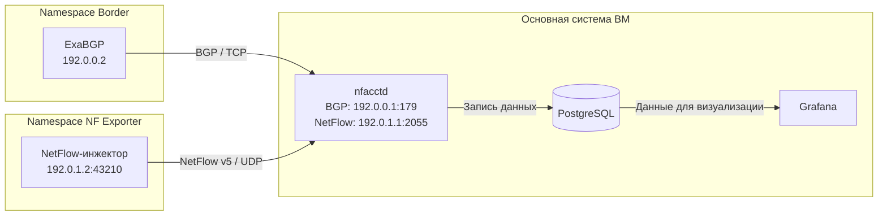

Дата обновления: 18.09.2026.

Общий ориентир: [[План создания]]. Ниже — уточнённый план с отдельным namespace `NF Exporter`. Он заменяет прежнее размещение NetFlow-инжектора в `Border`. Работы здесь запланированы; готовые скрипты и конфигурации будут создаваться при реализации.

## 1. Назначение и место в проекте

Создать управляемый генератор NetFlow v5, который отправляет известные записи в `nfacctd` и позволяет проверить приём, сопоставление с BGP и учёт объёмов. Инжектор формирует сообщения о синтетических потоках: соответствующий пользовательский трафик через ВМ не проходит.

Размещение компонентов:

- `Border`: существующий ExaBGP в `/opt/exabgp-env`, источник BGP-маршрутов.
- `NF Exporter`: отдельный сетевой namespace для NetFlow-инжектора, Python из `/opt/netflow-env`.
- Основная система ВМ: `nfacctd`, позднее PostgreSQL и Grafana по общему плану.

Планируемая схема после подключения BGP к nfacctd:

Сейчас подтверждена BGP-сессия ExaBGP с BIRD. Ближайшая цель — перевести её непосредственно на nfacctd и подтвердить получение двух тестовых префиксов вместе с AS_PATH. После этого создавать NetFlow-инжектор. BIRD как посредник в итоговой схеме не нужен: nfacctd сам принимает BGP от ExaBGP и NetFlow от инжектора.

## 2. Зафиксировать параметры первой версии

| Параметр                | Решение                                                                                 |
| ----------------------- | --------------------------------------------------------------------------------------- |
| Формат                  | NetFlow v5, IPv4                                                                        |
| Namespace инжектора     | `NF Exporter`                                                                           |
| Адрес экспортёра        | `192.0.1.2/30`                                                                          |
| Адрес коллектора        | `192.0.1.1/30`, основная система ВМ                                                     |
| UDP-порты               | Источник `43210`, получатель `2055`                                                     |
| Новая veth-пара         | `veth-collector` на основной системе, предлагаемый `veth-exporter` внутри `NF Exporter` |
| Окружение               | `/opt/netflow-env`, отдельно от ExaBGP                                                  |
| Формирование и отправка | Scapy собирает NetFlow, обычный UDP-сокет Python отправляет байты                       |
| Sampling                | Отключён                                                                                |
| Размер сообщения        | Одна flow record в каждой датаграмме                                                    |
| Режим работы            | Одна запись или конечная серия с остановкой                                             |

Сокет привязывается к `192.0.1.2:43210` внутри `NF Exporter` и отправляет только NetFlow payload в `192.0.1.1:2055`. Внешние IP/UDP-заголовки формирует ОС. Порт `43210` нужен для предсказуемого источника экспорта.

BGP-префиксы для первого положительного теста: `10.100.100.0/24` и `10.200.200.0/24`. Адреса потоков из этих сетей находятся внутри NetFlow-записи; назначать их интерфейсам инжектора не требуется.

Первая версия ограничена одним экспортёром и воспроизводимыми сценариями. NetFlow v9/IPFIX, случайная нагрузка и постоянный сервис пока не нужны.

## 3. Подготовить nfacctd, перевести BGP и создать NF Exporter

Выполнять этапы в указанном порядке. Сначала проверить BGP на уже работающей сети `Border`, затем добавлять сеть NetFlow.

**Сначала — установка и переход с BIRD на nfacctd.**

- [x] Сохранить рабочие конфигурации BIRD и ExaBGP, адресацию `Border` и пример полученных маршрутов. Зафиксировать текущее состояние BGP-сессии для сравнения после перехода.
- [x] Установить pmacct, проверить наличие nfacctd, его версию и поддержку BGP в установленной сборке. Проверить наличие `iproute2`, `tcpdump` и доступ к журналам процесса. PostgreSQL и Grafana устанавливать на этапе подключения хранения и визуализации.
- [ ] Подготовить встроенный BGP-приёмник nfacctd на `192.0.0.1:179`: локальная AS `65001`, сосед ExaBGP `192.0.0.2`, AS `65002`. Сверить эти параметры с действующей конфигурацией ExaBGP. На этом этапе использовать диагностический вывод без зависимости от БД; не привязывать NetFlow-приёмник к ещё не созданному адресу `192.0.1.1`.
- [ ] Остановить BIRD, освободить его TCP-порт `179` и запустить nfacctd. Пока сохранить установленный BIRD и его конфигурацию для возможности возврата. После успешной проверки исключить одновременный автоматический запуск двух служб на одном адресе и порту.
- [ ] Подтвердить установленную сессию ExaBGP → nfacctd и получение в BGP-таблицу nfacctd префиксов `10.100.100.0/24` и `10.200.200.0/24` с ожидаемыми AS_PATH. Использовать доступный в установленной версии вывод BGP-таблицы/дамп и журналы, а не только статус сессии.

**Критерий перехода:** nfacctd получил оба префикса и их атрибуты. Он хранит маршруты для обогащения потоков и не устанавливает их в таблицу маршрутизации Linux. Поэтому `ip route` после замены BIRD не является проверкой BGP-таблицы nfacctd. См. [документацию pmacct](https://github.com/pmacct/pmacct/blob/master/QUICKSTART).

**Затем — отдельная сеть и окружение NetFlow.**

- [ ] Создать `NF Exporter` и отдельную veth-пару из раздела 2, назначить адреса, поднять обе стороны и loopback. Существующую пару для `Border` сохранить. Имя `NF Exporter` содержит пробел: при дальнейшей работе передавать его командам как один аргумент.
- [ ] Проверить доступность `192.0.1.1` из `NF Exporter` и разрешение UDP `2055` на основной системе. Проверить отсутствие конфликта выбранной подсети и имён интерфейсов с существующей сетью ВМ.
- [ ] Проверить `/opt/netflow-env`, установить Scapy при необходимости и записать версии Python и Scapy. Запускать будущий инжектор внутри namespace именно интерпретатором этого venv. Namespace изолирует сеть, venv — зависимости Python.
- [ ] Разместить будущий исходник отдельно от venv, например `/opt/netflow-injector/flow_injector.py`; предусмотреть журнал результатов каждого запуска.
- [ ] После создания адреса `192.0.1.1` настроить приём NetFlow в том же nfacctd на `192.0.1.1:2055`. Сохранить прямую BGP-сессию с ExaBGP на `192.0.0.1:179` и проверить её состояние после применения настроек.
- [ ] Настроить `bgp_agent_map`: экспортёр **`192.0.1.2` → BGP-сосед `192.0.0.2`**. Проверить загрузку карты и получение обоих тестовых префиксов от ExaBGP.
- [ ] В nfacctd выбрать получение нужных AS и префиксов из BGP, включить необходимые поля результата для проверки адресов, интерфейсов, объёмов и AS_PATH. Конкретные ключи сверить с установленной версией pmacct.

Оба namespace обращаются к адресам основной системы через свои непосредственно подключённые сети. Для этой схемы не нужны NAT, пересылка пакетов между namespace или маршрут по умолчанию внутри `NF Exporter`.

**Почему нужна карта:** NetFlow приходит от `192.0.1.2`, а BGP — от `192.0.0.2`. Карта связывает экспортёра с таблицей нужного BGP-соседа; она не изменяет адреса потоков и не создаёт маршруты. См. [официальный пример bgp_agent_map](https://github.com/pmacct/pmacct/blob/master/examples/bgp_agent.map.example).

**Результат:** определён путь доставки NetFlow, а коллектор знает, с какой BGP-таблицей сопоставлять записи этого экспортёра.

## 4. Реализовать формирование и отправку записей

Для начала достаточно одного файла с функциями проверки параметров, сборки записи, отправки и журналирования. Параметры сценария должны меняться без переделки бинарного формата.

Базовая запись:

| Поля | Значения |
| --- | --- |
| Адреса | `10.100.100.5 → 10.200.200.5` |
| Протокол и порты | TCP (`6`), `12345 → 443` |
| Входной / выходной ifIndex | `101 / 10` |
| Пакеты / байты | `5000 / 7 500 000` |
| AS и маски в самой записи | Нули: обогащение проверяется по BGP |

`101` и `10` — условные интерфейсы моделируемого экспортёра, а не реальные индексы veth. Полный AS_PATH берётся из BGP: в NetFlow v5 такого поля нет.

- [ ] Собрать заголовок v5 и одну запись средствами Scapy. Проверить `version = 5`, `count = 1`, отключённый sampling и фиксированные идентификаторы engine. Ожидаемый размер NetFlow payload: **72 байта** — 24 байта заголовка и 48 байт записи.
- [ ] Согласовать время: `First`, `Last` и `sysUptime` относятся к одной точке отсчёта экспортёра и выражены в миллисекундах; `0 ≤ First < Last ≤ sysUptime`. Unix-время заголовка соответствует моменту экспорта. Интервал записи должен совпадать с интервалом моделируемого потока.
- [ ] Начать `flowSequence` с нуля и увеличивать на число отправленных записей. При одной записи на датаграмму серия из десяти сообщений имеет sequence `0…9`. Для разных сценариев внутри одного запуска последовательность общая.
- [ ] Предусмотреть проверку сборки без отправки, отправку одной записи и конечную серию с заданным интервалом. Проверять допустимость адресов, портов, счётчиков и времени до отправки.
- [ ] В журнале сохранять идентификатор запуска, сценарий, время, sequence, число отправленных записей и ожидаемые суммы байтов/пакетов. При ошибке отправки явно отмечать незавершённый прогон.

Успешная отправка UDP не подтверждает приём. Автоматически повторять сообщение без подтверждённой причины не следует: это может удвоить учёт. Повторный запуск оформлять как отдельный прогон и проверять в отдельном временном окне.

## 5. Проверить результат и подготовить сценарий для Grafana

Проверки выполнять последовательно: сначала доставка и декодирование, затем BGP, затем БД и графики.

| Проверка | Действие и ожидаемый результат |
| --- | --- |
| Одна запись | Захватить пакет на `veth-collector`: источник `192.0.1.2:43210`, получатель `192.0.1.1:2055`, корректный v5 и значения базовой записи. Подтвердить декодирование в nfacctd. |
| Контрольные суммы | Отправить 10 базовых записей. Итог: **75 000 000 байт, 50 000 пакетов**. Сравнить журнал, захват и результат коллектора; дождаться завершения выгрузки. |
| BGP-сопоставление | Для обеих сторон базового потока проверить найденные префиксы и AS-атрибуты по фактически полученным маршрутам ExaBGP. Проверить, что карта выбрала соседа `192.0.0.2`. |
| Неизвестный адрес | Заменить адрес источника на `10.250.250.5`, предварительно убедившись, что его не покрывает ни один полученный маршрут, включая default. Запись учитывается, но соответствующие BGP-атрибуты отсутствуют/нулевые. |
| Более точный маршрут и отзыв | Добавить тестовый `/25` внутри одного `/24`, проверить выбор наиболее длинного совпадающего префикса для адресов внутри и вне `/25`. Отозвать `/25`, дождаться изменения BGP-таблицы и проверить новые записи: они используют `/24`. |

Для PostgreSQL и Grafana подготовить один минутный сценарий с двумя условными входными интерфейсами:

| Поток | ifIndex входа | Записей за минуту | Байтов / пакетов в записи | Итог за минуту | Средняя скорость |
| --- | --- | --- | --- | --- | --- |
| A | 101 | 6 | 7 500 000 / 5000 | 45 000 000 байт / 30 000 пакетов | 6 Мбит/с |
| B | 102 | 6 | 2 500 000 / 2000 | 15 000 000 байт / 12 000 пакетов | 2 Мбит/с |

Каждая запись описывает отдельный десятисекундный интервал соответствующего потока. За шесть интервалов общий итог — **12 записей, 60 000 000 байт, 42 000 пакетов и 8 Мбит/с в среднем за 60 секунд**. Это моделируемый объём, а не скорость отправки UDP-пакетов инжектором.

- [ ] Сохранить в БД признаки для раздельного учёта A и B, BGP-атрибуты и временные интервалы согласно общему плану. Число SQL-строк может отличаться от числа flow records из-за агрегации; сверять суммы и нужные группы.
- [ ] Проверить итог после выгрузки всех записей. Согласовать временные корзины nfacctd и запрос Grafana: скорость считать как `байты × 8 / длительность интервала`, с единицами Мбит/с = 1 000 000 бит/с.
- [ ] Показать в Grafana объёмы по интерфейсам, префиксам и AS, сверить их с эталоном. AS_PATH характеризует полученный BGP-маршрут и сам по себе не доказывает фактический путь входящего трафика.

**Готовность инжектора:** он воспроизводимо работает в `NF Exporter`, отправляет корректный NetFlow v5, а nfacctd принимает записи и обогащает их из нужной BGP-таблицы. Завершающая проверка стенда — совпадение контрольных сумм в PostgreSQL и Grafana. Реализация автобалансировщика в этот план не входит.
