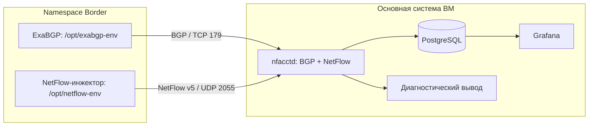

# План создания лабораторного стенда pmacct

Актуализирован: 17.09.2026.

## 1. Цель и границы проекта

Создать на одной Linux-ВМ воспроизводимый лабораторный стенд, который принимает синтетические BGP-анонсы и NetFlow, сопоставляет адреса потоков с BGP-префиксами, сохраняет обогащённую статистику в PostgreSQL и показывает её в Grafana.

Результат проекта — проверенная цепочка **ExaBGP + NetFlow-инжектор → nfacctd → PostgreSQL → Grafana**. По панели должно быть понятно, какие источники, префиксы и AS формируют объём трафика и как этот объём распределяется между условными интерфейсами.

В этом проекте используется небольшой известный набор маршрутов и потоков. Подключение к рабочей сети провайдера, полные интернет-таблицы, реальная пересылка пользовательского трафика и разработка автобалансировщика находятся за его границами.

Документ описывает порядок работ, принимаемые решения и критерии готовности. Готовые скрипты, конфигурационные файлы служб и SQL-запросы будут создаваться при реализации соответствующих этапов.

### 1.1. Как читать статусы

- **Выполнено** — подтверждено владельцем стенда; повторно выполнять этот этап сейчас не требуется.
- **Запланировано** — работа ещё предстоит; приведённые параметры являются целевыми.
- **Требует фиксации** — сведения нужно снять с ВМ и записать; неизвестное значение не считается настроенным.

Основание для текущего статуса — фактическое уточнение владельца и действующие конфигурации из [[Конфигурация ExaBGP и BIRD]]. Ранние утверждения в других заметках о якобы уже работающем NetFlow-инжекторе не отражают текущее состояние.

### 1.2. Подтверждённое состояние

| Компонент                      | Состояние на дату плана                                                                         |
| ------------------------------ | ----------------------------------------------------------------------------------------------- |
| Linux-ВМ                       | Используется как основная система стенда                                                        |
| Namespace `Border` и veth-пара | Созданы и обеспечивают сетевую связность                                                        |
| ExaBGP                         | Работает внутри `Border`, использует `/opt/exabgp-env`                                          |
| BIRD                           | Работает на основной системе                                                                    |
| BGP ExaBGP → BIRD              | Сессия UP, маршруты передаются                                                                  |
| Маршруты в Linux               | Владелец проверил через `ip route`: анонсы из конфигурации ExaBGP появились                     |
| NetFlow-инжектор               | Ещё не реализован на сервере                                                                    |
| Окружение для NetFlow          | Отдельное от ExaBGP; целевой путь `/opt/netflow-env`, наличие и зависимости нужно сверить на ВМ |
| nfacctd, PostgreSQL, Grafana   | Их настройка в рамках этой цепочки предстоит                                                    |

**Точка продолжения текущих работ — раздел 6, этап 4. Разделы 3–5 описывают путь с нуля до уже достигнутого результата.**

### 1.3. Навигация по плану

- [[#2. Архитектура и параметры стенда|Архитектура и параметры]]
- [[#3. Этап 1. Подготовка ВМ и сетевого окружения|Уже сделано: ВМ и сеть]]
- [[#4. Этап 2. Подготовка инжектора маршрутов ExaBGP|Уже сделано: ExaBGP]]
- [[#5. Этап 3. Проверка BGP через BIRD|Уже сделано: проверка BIRD]]
- [[#6. Этап 4. Подготовка к переходу с BIRD на nfacctd|Продолжение: подготовка перехода]] *
- [[#7. Этап 5. Прямой приём BGP в nfacctd|BGP в nfacctd]]
- [[#8. Этап 6. Проектирование и создание NetFlow-инжектора|Отдельный NetFlow-инжектор]]
- [[#9. Этап 7. Проверка NetFlow и BGP-сопоставления без БД|Проверки учёта и сопоставления]]
- [[#10. Этап 8. Проектирование данных и подготовка PostgreSQL|Проектирование БД]]
- [[#11. Этап 9. Запись обогащённой статистики из nfacctd в PostgreSQL|Проверка записи в БД]]
- [[#12. Этап 10. Подключение Grafana и создание панели|Grafana]]
- [[#13. Этап 11. Повторяемый запуск и итоговая приёмка|Воспроизводимость и приёмка]]
- [[#14. Краткая карта диагностики|Поиск неисправностей]]

## 2. Архитектура и параметры стенда

### 2.1. Схема уже выполненной проверки

`ExaBGP в Border → BGP/TCP 179 → BIRD на ВМ → таблица маршрутизации Linux`.

BIRD использовался для проверки, что инжектор устанавливает BGP-сессию и передаёт маршруты. Наличие этих маршрутов в `ip route` подтверждало работу именно данной связки.

### 2.2. Целевая схема

BIRD после переключения не участвует в рабочем тракте стенда. Его конфигурация сохраняется как описание пройденного этапа и возможность вернуться к прежней проверке.

Внутри namespace работают два отдельных процесса. `venv` разделяют зависимости Python; namespace задаёт сетевое окружение. Окружения Python сами по себе не создают отдельные IP-адреса или сетевые интерфейсы.

### 2.3. Адреса, ASN и роли

| Параметр | Значение | Примечание |
| --- | --- | --- |
| Namespace | `Border` | Уже создан |
| Интерфейс основной системы | `veth-host` | Уже создан |
| Интерфейс namespace | `veth-Border` | Уже создан |
| Адрес основной системы | `192.0.0.1/30` | Сохраняется при переходе с BIRD на nfacctd |
| Адрес namespace | `192.0.0.2/30` | Адрес ExaBGP и NetFlow-экспортёра |
| AS инжектора | `65002` | Текущая конфигурация ExaBGP |
| AS принимающей стороны | `65001` | Сейчас BIRD, затем явно заданный ASN nfacctd |
| Конфигурация ExaBGP | `/etc/exabgp.conf` | Действующая |
| Конфигурация BIRD | `/etc/bird/bird.conf` | Действующая на выполненном этапе |
| Окружение ExaBGP | `/opt/exabgp-env` | Работает |
| Окружение NetFlow | `/opt/netflow-env` | Использовать отдельно от ExaBGP |
| BGP | TCP `179` на `192.0.0.1` | После переключения принимает nfacctd |
| NetFlow | UDP `2055` на `192.0.0.1` | Задать явно на обеих сторонах |
| БД | PostgreSQL на этой же ВМ | Рабочее имя БД: `pmacct_lab` |
| Визуализация | Grafana на этой же ВМ | Читает PostgreSQL через источник данных |

Существующая адресация здесь сохранена для последовательного перехода. `192.0.0.0/24` относится к специальному пространству IETF; при отдельном пересоздании стенда лучше выбрать свободную частную подсеть. Такая перенумерация не является обязательным условием текущего перехода и должна выполняться отдельным согласованным изменением. [Реестр IANA](https://www.iana.org/assignments/iana-ipv4-special-registry).

### 2.4. Правила интерпретации данных

1. **IP экспортёра** — `192.0.0.2`, источник UDP-пакета с NetFlow. **IP источника потока** находится внутри записи NetFlow, например `10.100.100.5`. Это разные сущности.
2. BGP-префиксы теста не требуется назначать интерфейсам. Для синтетической проверки достаточно анонсов и адресов внутри записей NetFlow.
3. nfacctd сопоставляет потоки с полученными BGP-таблицами. Он не должен устанавливать эти маршруты в ядро Linux.
4. `src_as_path` относится к поиску маршрута по адресу источника, `as_path` — по адресу назначения. Наличие анонса только для одной стороны не обеспечивает заполнение обеих.
5. AS_PATH к источнику не доказывает фактический путь входящего пакета: направления могут быть асимметричны. В Grafana этот показатель называется «BGP-путь к префиксу источника».
6. Числа байтов в синтетических записях моделируют объём. Они не означают, что такой объём действительно прошёл через veth.

Основания: [обогащение потоков в pmacct](https://github.com/pmacct/pmacct/blob/master/docs/FLOW_AUGMENTATION_PROCESS_DESCRIPTION.md), [AS_PATH в RFC 4271](https://www.rfc-editor.org/rfc/rfc4271.html#section-5.1.2).

## 3. Этап 1. Подготовка ВМ и сетевого окружения

**Статус: выполнено в объёме, необходимом для работающей BGP-связки.**

### Что было сделано

1. В качестве основной системы выбрана Linux-ВМ.
2. Создан отдельный network namespace `Border`.
3. Создана veth-пара `veth-host` / `veth-Border`.
4. `veth-host` оставлен в основной системе, `veth-Border` помещён в `Border`.
5. Назначены адреса `192.0.0.1/30` и `192.0.0.2/30` соответственно.
6. Обеспечена работоспособность интерфейсов и связность, достаточная для BGP-сессии между namespace и основной системой.

### Полученный результат

На одной ВМ существуют два сетевых окружения, между которыми работает IP-соединение. ExaBGP может использовать адрес `192.0.0.2`, а принимающий процесс — `192.0.0.1`.

### Что нужно дополнительно записать при документировании

- Дистрибутив, его версию и версию ядра.
- Выделенные CPU, RAM и диск ВМ.
- Состояние loopback внутри `Border`.
- Фактические адреса и состояния обеих сторон veth.
- Способ восстановления namespace и интерфейсов после перезагрузки; пока он не подтверждён.
- Действующие правила firewall, влияющие на соединение между этими адресами.

Повторно создавать уже существующий namespace и veth-пару не требуется. При воспроизведении с нуля этот этап должен закончиться той же схемой связности.

## 4. Этап 2. Подготовка инжектора маршрутов ExaBGP

**Статус: выполнено.**

### Что было сделано

1. Для ExaBGP выделено Python-окружение `/opt/exabgp-env`.
2. ExaBGP установлен и запускается из этого окружения внутри `Border`.
3. Создана конфигурация `/etc/exabgp.conf`.
4. Заданы локальный адрес `192.0.0.2`, локальный AS `65002` и сосед `192.0.0.1` в AS `65001`.
5. В конфигурацию добавлены маршруты `10.100.100.0/24` и `10.200.200.0/24` с next-hop `192.0.0.2`.
6. Обеспечен запуск ExaBGP и установление сессии с BIRD.

### Полученный результат

Работает управляемый источник небольшого набора BGP-анонсов. Их содержимое задаётся в конфигурации ExaBGP и может использоваться как эталон для последующих проверок.

### Что нужно сохранить

- Актуальную конфигурацию из [[Конфигурация ExaBGP и BIRD]].
- Фактическую версию ExaBGP и Python внутри его venv.
- Способ запуска процесса и расположение его журнала.
- Список анонсов с атрибутами, действительно увиденными принимающей стороной.

Наличие работающего venv не требует переустановки ExaBGP или удаления системных пакетов. Зависимости NetFlow в `/opt/exabgp-env` не добавляются.

## 5. Этап 3. Проверка BGP через BIRD

**Статус: выполнено и проверено владельцем.**

### Что было сделано

1. На основной системе установлен и настроен BIRD.
2. В `/etc/bird/bird.conf` задан AS `65001` и сосед `192.0.0.2` в AS `65002`.
3. Настроен приём анонсов от ExaBGP.
4. Через kernel-протокол BIRD полученные маршруты переданы в таблицу Linux.
5. Проверено, что BGP-сессия находится в состоянии UP.
6. Через `ip route` проверено появление маршрутов из конфигурации ExaBGP.

### Что этот этап подтверждает

- Сетевое соединение namespace с основной системой работает.
- ExaBGP запускается и устанавливает BGP-сессию с ожидаемым ASN соседа.
- Статические анонсы действительно передаются и принимаются BIRD.

### Чего этот этап пока не подтверждает

- Приём и декодирование NetFlow.
- BGP-сопоставление в nfacctd.
- Запись статистики в PostgreSQL.
- Правильность цифр на панели Grafana.

**Это текущий завершённый рубеж. Следующие этапы ещё предстоит выполнить.**

## 6. Этап 4. Подготовка к переходу с BIRD на nfacctd

**Статус: запланировано.**

**Цель:** сохранить проверенную исходную точку и подготовить коллектор, прежде чем переключать BGP-соседа.

### 6.1. Зафиксировать исходное состояние

- [x] Сохранить копии действующих конфигураций ExaBGP и BIRD с датой.
- [ ] Записать версии ОС, ExaBGP и BIRD.
- [x] Сохранить вывод состояния BGP-сессии, принятых префиксов и `ip route`.
- [x] Записать, какие процессы и службы сейчас запускают BIRD и ExaBGP.
- [x] Проверить, нет ли второго экземпляра этих демонов.
- [ ] Зафиксировать текущие адреса, интерфейсы и занятые TCP/UDP-порты.

### 6.2. Подготовить pmacct

- [ ] Выбрать доступную стабильную сборку pmacct для установленной ОС и записать её версию.
- [ ] Проверить наличие `nfacctd`: именно он принимает NetFlow/IPFIX.
- [ ] Проверить поддержку BGP, диагностического вывода и PostgreSQL-плагина `pgsql`.
- [ ] Для удобного JSON-вывода и BGP-дампов проверить наличие соответствующей поддержки JSON в сборке.
- [ ] До первого запуска посмотреть, устанавливает ли пакет автоматически запускаемую службу и какой конфигурационный файл она использует.
- [ ] Выбрать один явный путь к рабочему конфигу nfacctd и записать его. Не считать произвольный пример пути фактическим путём установленного пакета.
- [ ] Выбрать расположение журналов и диагностических файлов, доступное пользователю службы.

Для инвентаризации подходят `nfacctd -V`, `nfacctd -h` и `nfacctd -a`. Список поддерживаемых параметров нужно сверять с установленной версией. Если пакет не содержит необходимого плагина, сначала выбрать подходящую сборку, затем продолжать настройку.

pmacct поддерживает вывод в память, файлы и PostgreSQL. Для этого стенда первый запуск выполняется с диагностическим выводом, а БД подключается после проверки обогащения. [pmacct Quickstart](https://github.com/pmacct/pmacct/blob/master/QUICKSTART).

### 6.3. Подготовить переключение

- [ ] Сохранить текущие IP-адреса и ASN; не менять одновременно адресацию, инжектор и принимающую сторону.
- [ ] Запланировать остановку BIRD и отключение его автоматического запуска для целевой схемы.
- [ ] Проверить, что BGP-порт `192.0.0.1:179` сможет занять nfacctd; учитывать и прослушивание BIRD на всех адресах.
- [ ] Сохранить возможность восстановить исходную проверку: остановить nfacctd, освободить его BGP-сокет и запустить прежний BIRD с сохранённой конфигурацией.

В действующем BIRD-конфиге есть `persist`. Поэтому после остановки BIRD некоторые маршруты могут остаться в ядре. Они не доказывают приём BGP новым коллектором. Для синтетической корреляции удалять их не требуется; нельзя очищать всю таблицу маршрутизации ради такого теста. [Kernel-протокол BIRD](https://bird.nic.cz/doc/bird-2.16.2.html#kernel).

**Критерий завершения:** исходная рабочая связка задокументирована, подходящий nfacctd установлен, выбран его конфиг и понятен порядок переключения и возврата.

## 7. Этап 5. Прямой приём BGP в nfacctd

**Статус: запланировано.**

**Цель:** получить в nfacctd те же тестовые маршруты, которые ранее принимал BIRD.

### 7.1. Требования к будущей конфигурации

| Область | Целевое решение |
| --- | --- |
| BGP-приём | Включён внутри nfacctd |
| Локальный адрес и порт | `192.0.0.1`, TCP `179` |
| Локальный AS | Явно `65001`, как ожидает текущий ExaBGP |
| Router ID | Явно заданный стабильный IPv4-идентификатор; для стенда `192.0.0.1` |
| BGP-сосед | ExaBGP `192.0.0.2`, AS `65002` |
| NetFlow-приём | `192.0.0.1`, UDP `2055`, даже пока инжектор не запущен |
| Первичный результат | Диагностический вывод и проверяемое содержимое BGP RIB |
| PostgreSQL | Пока не подключать |

Ориентиры в актуальной документации: `bgp_daemon`, `bgp_daemon_ip`, `bgp_daemon_port`, `bgp_daemon_as`, `bgp_daemon_id`, `nfacctd_ip`, `nfacctd_port`. Особенно важно явно задать ASN и UDP-порт: upstream nfacctd использует NetFlow-порт `2100` по умолчанию, а без заданного BGP ASN может зеркалировать ASN соседа для iBGP. [Справочник параметров pmacct](https://github.com/pmacct/pmacct/blob/master/CONFIG-KEYS).

### 7.2. Порядок запуска

1. Подготовить конфигурацию под установленную версию и проверить её синтаксис доступным в этой версии способом.
2. Остановить BIRD, убедиться, что он не перезапустился автоматически.
3. Проверить освобождение BGP-порта.
4. Запустить ровно один экземпляр nfacctd, на первом проходе с наблюдаемыми журналами.
5. Проверить, что nfacctd открыл ожидаемые TCP- и UDP-сокеты.
6. Дождаться соединения ExaBGP; при необходимости выполнить его контролируемое переподключение.
7. Подтвердить BGP-состояние Established и получение UPDATE с двумя ожидаемыми префиксами.
8. Сохранить журнал этого запуска и фактическую конфигурацию принимающей стороны.

Соединение инициирует ExaBGP, а BGP-часть nfacctd принимает его. Не переводить обе стороны в пассивный режим. BGP-приём должен работать внутри того же nfacctd, который обрабатывает NetFlow: запуск отдельного `pmbgpd` сам по себе не передаёт его таблицу в nfacctd. [BGP в pmacct](https://github.com/pmacct/pmacct/blob/master/QUICKSTART).

### 7.3. Проверить именно таблицу pmacct

- [ ] Настроить доступный в сборке способ просмотра BGP RIB.
- [ ] Предпочтительный вариант для этого стенда — периодический дамп в JSON через `bgp_table_dump_file` и `bgp_table_dump_refresh_time`.
- [ ] Для первого дампа выбрать интервал 60 секунд, если он поддерживается установленной версией; дождаться нового файла после текущего подключения.
- [ ] Найти `10.100.100.0/24` и `10.200.200.0/24` именно у peer `192.0.0.2`.
- [ ] Проверить next-hop и фактически полученный AS_PATH каждого маршрута.
- [ ] Записать время дампа и адрес peer, чтобы не принять старый файл за результат текущего запуска.

Если выбранный формат дампа недоступен в сборке, проблему диагностики нужно решить на этом этапе. Статус Established сам по себе не подтверждает содержимое таблицы. И напротив, отсутствие анонсов в `ip route` после перехода на nfacctd нормально: установка маршрутов в Linux больше не является задачей принимающего процесса.

**Критерий завершения:** ExaBGP соединён напрямую с nfacctd, оба префикса и их атрибуты подтверждены в свежем представлении его BGP RIB. BIRD не занимает порт и не участвует в цепочке.

## 8. Этап 6. Проектирование и создание NetFlow-инжектора

**Статус: запланировано; сам инжектор на сервере ещё не реализован.**

**Цель:** создать управляемый источник корректных NetFlow v5 записей, для которого заранее известны адреса, времена, интерфейсы и суммарные счётчики.

### 8.1. Отдельное окружение и размещение

- [ ] Проверить наличие `/opt/netflow-env`; если его нет, создать отдельное Python-окружение для инжектора.
- [ ] Установить Scapy в это окружение и зафиксировать версии Python и Scapy.
- [ ] Проверить, что ExaBGP продолжает использовать только `/opt/exabgp-env`.
- [ ] Выбрать каталог исходного файла инжектора отдельно от каталога venv. Записать полный путь после его создания.
- [ ] При запуске явно использовать Python из `/opt/netflow-env` и namespace `Border`.
- [ ] Предусмотреть права, необходимые выбранному способу отправки пакетов Scapy.

На этом этапе разрабатывается новый инжектор. Старый пример из прежней версии плана не следует переносить без проверки.

### 8.2. Требования к первой версии

1. Формат — NetFlow v5, IPv4, без sampling.
2. Экспортёр — `192.0.0.2`, коллектор — `192.0.0.1:2055/UDP`.
3. Первый режим — конечный прогон заданного числа записей, затем остановка.
4. Одна запись в UDP-датаграмме на первоначальном тесте: так проще проверить количество и последовательность.
5. Прогон печатает выбранный сценарий, число записей и ожидаемые итоговые байты/пакеты.
6. Каждая запись описывает отдельный интервал или отдельный поток. Нельзя повторять один накопительный счётчик и считать каждый повтор новым объёмом.
7. Параметры сценария отделены от логики формирования NetFlow: адреса, интерфейсы, длительность, число записей и счётчики должны быть явно заданы.
8. Непрерывный режим добавляется только после успешной проверки конечного прогона.

Для каждого прогона предусмотреть внешний журнал: идентификатор опыта, время начала/конца, версии, параметры сценария, число датаграмм и записей, ожидаемые суммы и BGP-атрибуты. Произвольного поля `run_id` в NetFlow v5 нет; идентификатор опыта хранится в журнале, а данные сопоставляются с ним по заранее определённому окну и признакам сценария.

NetFlow v5 выбран как простой фиксированный формат для IPv4-лаборатории. Проверка возможностей IPv6 и шаблонов NetFlow v9/IPFIX не входит в первую версию.

### 8.3. Требования к структуре пакета

Необходимо использовать общий заголовок NetFlow, отдельный заголовок версии 5 и запись версии 5. В Scapy это `NetflowHeader`, `NetflowHeaderV5` и `NetflowRecordV5`.

| Поле или группа | Требование |
| --- | --- |
| `version` | Версия 5 |
| `count` | Число записей; поле заголовка версии 5 |
| `sysUptime` | Условное время работы экспортёра в миллисекундах, последовательно растёт |
| Unix-время экспорта | Согласовано с реальным временем ВМ |
| `flowSequence` | Первая датаграмма — 0; каждая следующая — sequence предыдущей плюс её `count`, по модулю 2³² |
| Идентификатор экспортирующего процесса | Стабильные `engineType`/`engineID` в пределах сценария; сброс счётчиков при новом запуске фиксируется в журнале |
| `first`, `last` | Время начала/конца потока в миллисекундах относительно того же uptime |
| `src`, `dst` | Адреса из заранее определённого сценария |
| `input`, `output` | Осмысленные синтетические ifIndex; не оставлять все значения нулевыми |
| `dpkts`, `dOctets` | Число пакетов и байтов конкретной записи |
| Протокол и порты | Согласованные постоянные значения первого теста |
| Sampling | Явно несэмплированные данные; поведение коллектора проверяется по счётчикам |
| AS и маски внутри NetFlow | Не использовать для подмены BGP-результата; для доказательного теста задать нейтральные значения |

Имя поля счётчика пакетов в Scapy — `dpkts`. `count` принадлежит `NetflowHeaderV5`, а не общему `NetflowHeader`. Время отправки UDP само по себе не задаёт продолжительность потока. [API Scapy](https://scapy.readthedocs.io/en/latest/api/scapy.layers.netflow.html), [формат NetFlow v5 Cisco](https://www.cisco.com/c/en/us/td/docs/net_mgmt/netflow_collection_engine/3-6/user/guide/format.html).

### 8.4. Проверки перед непрерывной отправкой

- [ ] Собрать одну запись и сериализовать её без отправки.
- [ ] Разобрать полученные байты обратно и сравнить поля с заданным сценарием.
- [ ] Для одной v5-записи проверить размер NetFlow-части: 24 байта заголовка и 48 байт записи, всего 72 байта без IP/UDP.
- [ ] Проверить соотношение `first <= last <= sysUptime` для короткого теста без переполнения uptime.
- [ ] Отправить одну датаграмму из `Border` и увидеть её на принимающей стороне в packet capture.
- [ ] Убедиться, что внешний source IP действительно `192.0.0.2`, destination port `2055`, а внутри находятся ожидаемые IP потока.
- [ ] Проверить сообщения nfacctd о приёме и отсутствии ошибок декодирования.

**Критерий завершения:** инжектор выполняет конечный прогон, формирует корректные v5-записи и доставляет их в nfacctd. Код, параметры сценария и версии окружения записаны в [[NetFlow инжектор]] при последующей реализации.

## 9. Этап 7. Проверка NetFlow и BGP-сопоставления без БД

**Статус: запланировано.**

**Цель:** получить проверенную обогащённую статистику до добавления хранения и визуализации.

### 9.1. Сначала проверить только учёт

1. Использовать конечный тест из 10 записей.
2. В каждой записи задать 7 500 000 байт и 5000 пакетов.
3. Для исходного положительного сценария использовать `10.100.100.5 → 10.200.200.5`.
4. Выбрать один набор интерфейсов и один протокол, чтобы записи ожидаемо агрегировались.
5. Использовать диагностический `print`-вывод с коротким интервалом выгрузки; при необходимости подключить `memory` для разовых запросов.
6. Перед прогоном отделить результаты от предыдущих опытов: новый вывод/файл или зафиксированное непересекающееся окно времени.
7. После остановки генератора дождаться выгрузки оставшихся данных и сложить все части результата данного прогона.

**Эталон: 75 000 000 байт и 50 000 пакетов.** Количество строк вывода может быть меньше 10 из-за агрегации или больше одного из-за периодических выгрузок. Количество строк не равно количеству исходных flow records.

Если используется `memory`, повторные снимки одной и той же накопленной статистики нельзя складывать как независимые порции. Для `print` нужно учитывать именно выгрузки текущего прогона и сохранить их без перезаписи предыдущих частей.

### 9.2. Настроить явное обогащение из BGP

- [ ] Убедиться, что BGP-таблица заполнена до начала контрольного прогона.
- [ ] Явно выбрать BGP как источник ASN и префиксов, а не полагаться на поля NetFlow.
- [ ] Включить получение source AS_PATH из BGP.
- [ ] Вывести адреса потока, префиксы, ASN и AS_PATH обеих сторон вместе со счётчиками.
- [ ] Сопоставить результат с маршрутом и атрибутами из свежего дампа RIB.
- [ ] Проверить, что использована таблица peer, соответствующего экспортёру `192.0.0.2`.

Ориентиры для актуальных версий: `nfacctd_as: bgp`, `nfacctd_net: bgp`, `bgp_src_as_path_type: bgp`. Набор полей должен включать `src_as_path` и `as_path` отдельно. В прямой схеме адрес BGP peer совпадает с адресом экспортёра; отдельная карта соответствий понадобится только при отклонении от этой схемы. [Параметры pmacct](https://github.com/pmacct/pmacct/blob/master/CONFIG-KEYS), [пример карты экспортёр — BGP peer](https://github.com/pmacct/pmacct/blob/master/examples/bgp_agent.map.example).

### 9.3. Минимальный набор наблюдаемых полей

| Сущность | Поля pmacct для проверки |
| --- | --- |
| Адреса записи | `src_host`, `dst_host` |
| Результат поиска префиксов | `src_net`, `dst_net`, обязательно `src_mask`, `dst_mask` |
| Origin ASN | `src_as`, `dst_as` |
| BGP-пути | `src_as_path`, `as_path` |
| Экспортёр | `peer_src_ip` |
| Интерфейсы записи | `in_iface`, `out_iface` |
| Протокол | `proto` |
| Проверка sampling | `sampling_rate`, если доступно в выбранном выводе |
| Измеренный объём | Счётчики байтов и пакетов результата |

Это перечень для проектирования `aggregate`, а не готовая конфигурация. Наличие и представление полей проверяются через установленную сборку. Байты и пакеты являются счётчиками агрегата; их не нужно произвольно добавлять в список группировки как обычные измерения. Префикс хранится вместе с длиной: адрес сети `10.100.100.0` без маски не различает `/24` и `/25`.

### 9.4. Функциональные сценарии

Каждый сценарий запускать отдельно. Сначала зафиксировать ожидаемую RIB, затем отправить новый конечный набор записей, дождаться выгрузки и сравнить результат.

| ID | Сценарий | Ожидаемый результат |
| --- | --- | --- |
| T1 | Обе стороны потока входят в два исходных /24 | Корректно заполнены source и destination атрибуты; суммы совпадают с эталоном |
| T2 | Для тестовых префиксов заданы различные многоэлементные AS_PATH | Пути не перепутаны между source и destination; ASN согласованы с принятым путём |
| T3 | Адрес одной стороны вне всех анонсов, default route в BGP нет | Объём учтён, сопоставление отсутствующей стороны явно неизвестно; другая сторона остаётся корректной |
| T4 | Внутри одного /24 добавлен более специфичный /25 с иными атрибутами | Адрес внутри /25 получает его атрибуты; адрес из остальной части /24 — атрибуты /24 |
| T5 | AS_PATH существующего префикса изменён без смены IP потока | После подтверждения UPDATE новые записи получают новые атрибуты |
| T6 | Выбранный анонс отозван, другого покрывающего анонса нет | После подтверждения изменения RIB новые записи не получают старую BGP-привязку |
| T7 | Отозван только /25 при сохранённом /24 | Происходит ожидаемый возврат к покрывающему /24, а не обязательное отсутствие маршрута |
| T8 | Обратное направление известного потока | Source/destination поля меняются местами в соответствии с адресами |
| T9 | Разные синтетические входные ifIndex | Объёмы разделяются по интерфейсам без потери общей суммы |

Для T2 конкретные тестовые AS_PATH выбираются при подготовке сценария. Ожидаемое значение берётся из реально принятого BGP UPDATE/RIB, с учётом поведения ExaBGP и возможного добавления локальной AS. В тестовом пути не должно быть AS принимающей стороны `65001`, чтобы не создавать ненужную неоднозначность с проверкой петель.

При T5–T7 старые агрегаты и строки могут сохранять прежние атрибуты. Это история ранее обработанных записей. Проверять нужно новые записи после изменения RIB, отделяя их от уже накопленных данных. Сопоставление выполняется с доступным состоянием маршрутов при обработке, поэтому данный стенд не объявляется системой исторического восстановления BGP на момент начала любого старого flow.

**Критерий завершения:** T1–T9 имеют записанные ожидания и результаты; суммы сходятся, различие source/destination понятно, неизвестные и изменившиеся маршруты обрабатываются предсказуемо.

## 10. Этап 8. Проектирование данных и подготовка PostgreSQL

**Статус: запланировано.**

**Цель:** сохранять те же проверенные измерения в постоянное хранилище, пригодное для SQL-запросов и Grafana.

### 10.1. Установить и подготовить БД

- [ ] Установить PostgreSQL на основной системе ВМ и записать версию.
- [ ] Создать лабораторную БД `pmacct_lab`.
- [ ] Выделить отдельную учётную запись для записи из nfacctd.
- [ ] Выделить отдельную учётную запись только для чтения из Grafana.
- [ ] Для записи выдать права, соответствующие выбранному режиму SQL-плагина; на первом этапе потребуются в том числе INSERT и UPDATE.
- [ ] Проверить локальное подключение под обеими ролями.
- [ ] Определить единый стандарт времени: предпочтительно UTC в системе хранения и явно выбранная зона отображения в Grafana.
- [ ] Определить место хранения конфигурации подключения; пароль не дублировать в учебных заметках.

БД находится на той же ВМ. Для этой цепочки достаточно локального подключения; доступ к PostgreSQL из namespace генераторов не требуется.

### 10.2. Зафиксировать модель хранения

Предлагается хранить **агрегаты за минутные интервалы**. Одна логическая строка относится к одному временному интервалу и одному набору измерений. Сырые записи и отдельный архив всех BGP UPDATE в первую версию БД не включаются.

| Группа | Что сохранить | Для чего |
| --- | --- | --- |
| Время | Начало интервала и время обновления, совместимые с SQL-плагином | История и корректные временные графики |
| Источник данных | IP экспортёра | Отделять данные конкретного устройства |
| Интерфейсы | Входной и выходной ifIndex | Разделять условные аплинки |
| IP и сети | Адреса, сети и длины найденных префиксов обеих сторон для небольшой лаборатории | Проверять корректность сопоставления, различать /24 и вложенный /25 |
| AS | ASN источника и назначения | Таблицы объёмов по AS |
| BGP | Пути к префиксам источника и назначения | Проверять и показывать маршрутный контекст |
| Объём | Байты и пакеты | Итоги и расчёт средней скорости |
| Протокол | L4-протокол | Простая дополнительная группировка |
| Sampling | Значение/договорённость о несэмплированном учёте | Исключить незаметное масштабирование счётчиков |

Для счётчиков выбрать достаточную разрядность, в том числе `BIGINT` для байтов и пакетов. Для AS_PATH предусмотреть `TEXT` либо достаточный `VARCHAR`; не ограничивать длинные пути коротким полем из старого примера схемы. [Схема PostgreSQL для pmacct](https://github.com/pmacct/pmacct/blob/master/sql/README.pgsql), [числовые типы PostgreSQL](https://www.postgresql.org/docs/current/datatype-numeric.html).

### 10.3. Согласовать таблицу с SQL-плагином

- [ ] Выбрать схему, поддерживаемую установленной версией pmacct, либо подготовить собственную по её правилам.
- [ ] Сопоставить каждый выбранный primitive с реальным именем SQL-колонки. Не предполагать, что имена всегда совпадают.
- [ ] Учесть, что source AS_PATH и destination AS_PATH имеют разные колонки.
- [ ] Сохранить длины source/destination префиксов и включить их в различающие агрегаты измерения. Для отображения формировать полный CIDR из сети и маски.
- [ ] Предусмотреть обе стороны интерфейсов и идентификатор экспортёра.
- [ ] Согласовать типы временных колонок и часовой пояс с тем, что записывает плагин.
- [ ] Согласовать ключ строки с минутным интервалом и всеми измерениями, различающими агрегаты; учесть поддержку длинных полей выбранным способом индексации.
- [ ] Проверить, что повторная выгрузка части того же агрегата дополняет его счётчики, а не теряет данные и не создаёт неучтённые дубли.
- [ ] Добавить необходимый для временных запросов индекс; остальные индексы добавлять по конкретным запросам панели.

Для неизвестного BGP-сопоставления сначала выяснить фактическое представление pmacct: нули, пустые поля или иные значения. В панели преобразовывать их в понятное «нет BGP-сопоставления». Не считать нулевой ASN названием реального источника и не удалять такие записи из общих сумм.

### 10.4. Принять правила времени

Для лаборатории предлагается исходно использовать время потока, указанное корректным инжектором. В актуальных версиях этому соответствует сохранение внешних времён, то есть `nfacctd_time_new: false`. Для стандартных миллисекундных полей v5 сохранить `nfacctd_time_secs: false`; в первом опыте явно оставить `nfacctd_pro_rating: false`. Названия параметров сверить с установленной версией.

Принятые параметры первого эксперимента:

- Размер интервала хранения — 1 минута, выравнивание по границе минуты.
- Выгрузка в БД — каждые 10 секунд для удобства наблюдения.
- Режим записи — обычное обновление/добавление агрегатов, без ранней оптимизации в INSERT-only или COPY.
- Начало flow-интервала и экспорт записи заданы отдельно; нужно проверить, по какому времени плагин помещает запись в минутный интервал.
- Первые контрольные потоки не пересекают границы минут.
- Потоки, пересекающие границу, и режим распределения их объёма по интервалам проверяются отдельным опытом. Пропорциональное распределение, если его включить, является оценкой, а не измерением каждого мгновения.

Ориентиры: `sql_history`, `sql_history_roundoff`, `sql_refresh_time`, `sql_dont_try_update`, `nfacctd_time_new`, `nfacctd_pro_rating`. Конкретные значения и совместимость сверяются перед созданием конфигурации. Выгрузка каждые 10 секунд не превращает минутную агрегацию в точные десятисекундные измерения. [Справочник pmacct](https://github.com/pmacct/pmacct/blob/master/CONFIG-KEYS).

**Критерий завершения:** PostgreSQL доступен, роли настроены, схема и временная семантика согласованы с SQL-плагином, определено представление неизвестного сопоставления.

## 11. Этап 9. Запись обогащённой статистики из nfacctd в PostgreSQL

**Статус: запланировано.**

**Цель:** получить в БД тот же результат, который уже проверен без неё.

### Порядок работ

1. Подключить `pgsql`-плагин к существующему экземпляру nfacctd.
2. На время проверки сохранить параллельный диагностический вывод с теми же измерениями.
3. Настроить подключение к `pmacct_lab`, целевую таблицу и параметры агрегации.
4. Проверить запуск и отсутствие ошибок авторизации, несовместимых колонок и SQL-запросов.
5. Повторить конечный прогон с эталоном 75 000 000 байт и 50 000 пакетов.
6. Дождаться завершения обработки и как минимум очередной успешной выгрузки после последней записи.
7. Прочитать БД напрямую и сравнить суммы, адреса, интерфейсы, ASN и пути с диагностическим выводом.
8. Убедиться, что минутные интервалы соответствуют выбранным временам потока.
9. Повторить T2, T3, T5 и T6, чтобы проверить сохранение различных, неизвестных и изменившихся BGP-атрибутов.
10. Проверить, что данные остаются в БД после перезапуска коллектора, а новый прогон можно отличить от предыдущего по времени или явно выбранным признакам сценария.

### Что проверить отдельно

- [ ] Два вывода одного коллектора являются двумя представлениями одного результата; их нельзя складывать между собой.
- [ ] Один экспортируемый record учитывается один раз; нельзя запускать два одинаковых генератора незаметно для опыта.
- [ ] Повторная отправка той же записи может добавить объём повторно: последовательность NetFlow не является обещанием автоматической дедупликации.
- [ ] Периодические обновления одной строки БД не суммируются как её независимые исторические снимки.
- [ ] Диагностические записи и строки БД сравниваются на одном завершённом наборе данных, с одинаковыми фильтрами.
- [ ] Длинный AS_PATH сохраняется целиком, без обрезки и ошибки вставки.
- [ ] Для уже завершённого опыта нет оставшихся ошибок SQL и невыгруженных данных.

**Критерий завершения:** контрольные суммы и BGP-атрибуты в PostgreSQL совпадают с проверенным результатом nfacctd. До этого момента Grafana не используется для объяснения расхождений учёта.

## 12. Этап 10. Подключение Grafana и создание панели

**Статус: запланировано.**

**Цель:** сделать проверенные данные понятными и удобными для исследования.

### 12.1. Подготовить Grafana

- [ ] Установить Grafana на той же ВМ и зафиксировать версию.
- [ ] Настроить доступ к её веб-интерфейсу из рабочей машины.
- [ ] Добавить PostgreSQL как источник данных, используя роль только для чтения.
- [ ] Проверить соединение и чтение контрольных строк через Explore.
- [ ] Установить понятный часовой пояс панели и сравнить отображаемое время с БД.
- [ ] Задать минимальный интервал графиков 1 минуту в соответствии с гранулярностью хранения.
- [ ] Для лабораторного наблюдения выбрать обновление панели, например раз в 10 секунд; пояснить, что последняя минута ещё может дополняться.

Grafana имеет встроенный источник PostgreSQL и может выполнять SQL-запросы напрямую. Промежуточный Python-парсер для переноса данных из этой БД в Grafana не требуется. [Настройка источника PostgreSQL](https://grafana.com/docs/grafana/latest/datasources/postgres/configure/).

### 12.2. Состав первой панели

| Панель | Что показывает | Проверка |
| --- | --- | --- |
| Общий объём | Байты и пакеты за выбранный период | Совпадает с прямым запросом к БД |
| Средняя скорость | bit/s по завершённым временным интервалам | Рассчитывается из байтов и длительности интервала |
| Топ source AS | Объём по origin AS источника | Сумма категорий, включая неизвестные, соответствует общему объёму |
| Топ source-префиксов | Какие сети формируют объём, в формате CIDR | Сеть и длина префикса соответствуют результатам lookup |
| Destination AS и префиксы | Куда направлены потоки | Поля не перепутаны с source |
| Условные аплинки | Объём и скорость по входному ifIndex | Точно повторяет распределение синтетического сценария |
| BGP-контекст | Префикс, ASN, source/destination AS_PATH, экспортёр | Показаны именно сохранённые атрибуты |
| Нет BGP-сопоставления | Объём с неизвестным source и/или destination | Такие записи не исчезают из общих сумм |
| Свежесть данных | Время последнего обновления и возраст данных | Остановка инжектора становится видимой |

Доля неизвестных может считаться отдельно для source и destination. Если нужна объединённая категория «не сопоставлена хотя бы одна сторона», учитывать её как объединение условий, чтобы не посчитать одну запись дважды.

Фильтры первой версии: период времени, экспортёр, входной интерфейс, source AS и destination AS. Отдельные панели для каждой возможной комбинации не нужны.

### 12.3. Правила расчёта скорости и отображения

1. Для полного интервала средняя скорость в bit/s равна `сумма байтов × 8 / длительность интервала в секундах`.
2. Для минутной строки знаменатель — 60, для объединённого пятиминутного интервала — 300.
3. В SQL сначала суммируются байты по нужным измерениям и временному интервалу, затем применяется перевод в скорость.
4. При объединении нескольких минут учитывать длительность всей группы, а не продолжать делить на 60.
5. Частично заполненную текущую минуту обозначить как предварительную либо исключать из контрольного сравнения завершённых минут.
6. Отсутствие новых записей не всегда означает нулевой трафик. Для лаборатории «нет данных» и «0» показывать различимо; не заполнять все пробелы нулями без объяснения.
7. Счётчики уже сохранённого объёма не превращать в скорость через повторное накопление или произвольную производную.
8. Каждый запрос панели должен учитывать выбранный пользователем период времени.

Временная ось строится по началу интервала хранения — в согласованной схеме pmacct это `stamp_inserted`. `stamp_updated` используется для оценки свежести и не подменяет начало интервала при построении графика.

Для временных запросов использовать возможности PostgreSQL-редактора Grafana; итоговый SQL и группировку проверять в инспекторе запросов. [Документация редактора PostgreSQL](https://grafana.com/docs/grafana/latest/datasources/postgres/query-editor/).

### 12.4. Числовой эталон для наглядной демонстрации

Предлагается отдельный сценарий на одну полную минуту с двумя **синтетическими** входными интерфейсами одного экспортёра. Они моделируют разделение статистики по аплинкам, но не являются двумя физическими аплинками и не проверяют BGP-выбор между ними.

| Параметр | Группа A | Группа B |
| --- | --- | --- |
| Экспортёр | `192.0.0.2` | `192.0.0.2` |
| Условный входной ifIndex | `101` | `102` |
| Условный выходной ifIndex | `10` | `10` |
| Записей за минуту | 6 | 6 |
| Длительность каждой записи | 10 секунд, без перекрытия интервалов внутри группы | 10 секунд, без перекрытия интервалов внутри группы |
| Байтов в записи | 7 500 000 | 2 500 000 |
| Пакетов в записи | 5000 | 2000 |
| Байтов за минуту | 45 000 000 | 15 000 000 |
| Пакетов за минуту | 30 000 | 12 000 |
| Средняя скорость за полную минуту | 6 Мбит/с | 2 Мбит/с |

**Общий эталон: 60 000 000 байт, 42 000 пакетов, 12 исходных записей, 8 Мбит/с.** Здесь Мбит/с используется в десятичном смысле: 1 Мбит/с = 1 000 000 bit/s.

Начало сценария выравнивается по минуте в выбранной шкале времени; времена потоков должны соответствовать шести последовательным десятисекундным интервалам. Последняя запись может быть экспортирована уже на границе следующей минуты — при сравнении нужно дождаться её приёма и записи в БД. Обе группы можно направить между исходными известными префиксами; набор BGP-атрибутов в этом опыте держать неизменным.

**Критерий завершения:** Grafana показывает числа эталона, позволяет фильтровать A/B, корректно подписывает AS_PATH и неизвестные значения; цифры совпадают с PostgreSQL.

## 13. Этап 11. Повторяемый запуск и итоговая приёмка

**Статус: запланировано.**

**Цель:** сохранить рабочий стенд так, чтобы следующий запуск не требовал восстанавливать его устройство по памяти.

### 13.1. Привести запуск к понятному порядку

- [ ] Записать зависимости: namespace и veth → nfacctd и ExaBGP → заполненная RIB → NetFlow-инжектор.
- [ ] Для режима записи PostgreSQL должен быть готов до начала отправки тестовых потоков; Grafana запускается после доступности БД.
- [ ] Определить, что запускается как служба, а что вручную. Конечные приёмочные прогоны инжектора должны оставаться управляемыми.
- [ ] Если настраивается автозапуск, оформить восстановление namespace/veth до запуска сетевых процессов.
- [ ] Убедиться, что BIRD не стартует параллельно и не перехватывает BGP-порт.
- [ ] Предусмотреть сохранение и ограничение размера журналов, диагностических файлов и BGP-дампов.
- [ ] Определить срок хранения лабораторной статистики; первоначальное предложение — 7 дней с последующим пересмотром по объёму.
- [ ] Сохранить конфигурации, схему БД, описание сценариев и экспорт JSON панели Grafana.

### 13.2. Проверить остановку и восстановление

1. Завершить конечный прогон и дождаться подтверждённой выгрузки данных.
2. Остановить инжектор и проверить, что панель не продолжает показывать старую скорость как новую.
3. Перезапустить nfacctd, дождаться повторного получения BGP-маршрутов, затем запустить новый тест.
4. Переподключить ExaBGP и подтвердить восстановление ожидаемой RIB.
5. Убедиться, что данные завершённых опытов остались в PostgreSQL.
6. Один раз проверить перезагрузку ВМ и восстановление стенда по выбранному порядку — автоматически или по записанной ручной процедуре.

Потерю UDP-экспорта во время недоступности коллектора или невыгруженных данных при аварии нельзя считать автоматически устраняемой. В этой лаборатории такие прогоны помечаются как неполные и повторяются. Штатная приёмка выполняется на завершённых прогонах без известных потерь.

### 13.3. Что должно быть записано в заметках после реализации

| Материал | Содержание |
| --- | --- |
| [[Описание проекта и лабораторного стенда]] | Цель, фактическая целевая схема, адреса, роли и ограничения интерпретации |
| [[Конфигурация ExaBGP и BIRD]] | Проверенная исходная конфигурация; ясная пометка, что BIRD относится к первоначальному этапу |
| [[NetFlow инжектор]] | Реальный путь скрипта, отдельный venv, версия Scapy, параметры и примеры результатов |
| [[Scheme]] | Обновлённая схема фактической цепочки до PostgreSQL и Grafana |
| Конфигурация pmacct | Фактический конфиг, версия сборки, поля агрегации и способ проверки RIB; оформить при реализации |
| Хранение и визуализация | Схема таблиц, правила времени, права ролей без паролей, описание и экспорт панели |
| Результаты испытаний | Дата, версии, сценарий, ожидаемые числа, полученные числа, расхождения и их объяснение |

Обновление этих материалов — отдельные будущие действия по мере реализации. На этапе составления данного плана остальные заметки не изменяются.

### 13.4. Критерии завершения проекта

- [ ] ExaBGP работает в `Border` из `/opt/exabgp-env`.
- [ ] NetFlow-инжектор работает в том же namespace из отдельного `/opt/netflow-env`.
- [ ] BGP устанавливается напрямую с nfacctd; состав RIB проверяем и соответствует сценарию.
- [ ] nfacctd принимает NetFlow на явно заданном порту и правильно считает известные объёмы.
- [ ] Source/destination префиксы, ASN и AS_PATH сопоставляются ожидаемо.
- [ ] Проверены неизвестный префикс, более специфичный маршрут, изменение пути и отзыв анонса.
- [ ] PostgreSQL сохраняет данные без необъяснимых расхождений, обрезки атрибутов и временных сдвигов.
- [ ] Grafana показывает эталонные суммы и скорости, разделяет синтетические интерфейсы и обозначает отсутствие данных.
- [ ] В заметках есть актуальные конфигурации, версии, порядок запуска и результаты проверок.
- [ ] После перезапуска стенд можно воспроизвести по записанной процедуре.

## 14. Краткая карта диагностики

| Симптом | Сначала проверить |
| --- | --- |
| ExaBGP не соединяется с nfacctd | Процесс и listener, освобождение порта BIRD, адреса namespace, ASN, журнал BGP и firewall |
| BGP Established, но ожидаемых префиксов нет | Фактические анонсы, UPDATE, согласованное семейство IPv4, свежесть и принадлежность дампа RIB |
| UDP виден, строк нет | Порт 2055, корректность v5-заголовка, `count`, ошибки декодирования, фильтры и срок очередной выгрузки |
| Объём есть, AS_PATH отсутствует | RIB выбранного peer, соответствие экспортёра, покрытие нужного source/destination адреса, выбранные primitives и источник BGP-атрибутов |
| Source заполнен, destination нет | Есть ли отдельный маршрут к адресу назначения; не ожидать его из source-анонса |
| Суммы завышены | Повторы записей, второй генератор, sampling, сложение снимков memory, повторный учёт двух выводов или SQL-строк |
| Суммы занижены | Потери UDP, незавершённая выгрузка, фильтры, ошибки SQL, неверное временное окно, неполная последняя минута |
| После withdrawal виден старый путь | Сравниваются ли новые записи после изменения RIB; нет ли старого агрегата, сохранённого маршрута или покрывающего анонса |
| nfacctd считает, БД пуста | Наличие pgsql в сборке, подключение, роль, таблица, соответствие колонок и журнал SQL-плагина |
| БД верна, Grafana показывает другое | Фильтр времени, часовой пояс, группировка, единицы, знаменатель скорости, дублирующий JOIN и предварительные интервалы |
| После перезагрузки всё остановилось | Восстановление namespace/veth, порядок служб, реальные пути venv/конфигов и конкурирующий BIRD |

## 15. Рабочий порядок прохождения плана

Уже выполнено: **сеть → ExaBGP → проверка через BIRD**.

Далее: **фиксация исходного состояния → прямой BGP в nfacctd → отдельный NetFlow-инжектор → проверка счётчиков и BGP-сопоставления → PostgreSQL → сверка БД → Grafana → повторяемый запуск и приёмка**.

На каждом шаге сначала подтверждается его критерий готовности. Если появились расхождения, они устраняются на том уровне, где впервые возникли; добавление следующего компонента не заменяет проверку предыдущего.
