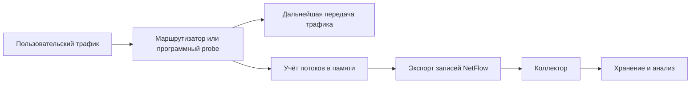

### Содержание:
1. [[#Описание работы NetFlow]]
2. [[#Примеры использования]]
3. [[#Реализация в контексте проекта]]

**Определение** - NetFlow это технология учета и передачи на сервер информации использования ресурсов сети. Как правило NetFlow учитывает передачу следующих параметров:
- IP назначения
- IP источника
- Порт назначения
- Количество байт и пакетов переданных за единицу времени
- Транспортный протокол передачи (UDP или TCP)
- Прочие данные

### Описание работы NetFlow

В NetFlow всегда учувствует 3 основных узла, первые два чаще всего находятся на одном устройстве (маршрутизаторе):
1. `Измеритель` - устройство видит проходящие через себя пакеты, собирает о них информацию и обновляет ее, ложа в отведенный для этого **Flowcache**
2. `Экспортер` - экспортирует данные из **Flowcache** на необходимый сервер, прописанный в конфигурации. Причиной экспорта являются определенные условия: ими могут быть как просто таймер, так и определенные события
3. `Коллектор` - выделенный сервер, который собирает пришедшие записи и хранит их у себя, преобразует для последующих целей
Сами NetFlow передаются по UDP. 

### Примеры использования 
1. Поиск самых популярных адресов и ASN, сетей и приложений
2. Анализ нагрузки сетевых интерфейсов
3. Учет потребления клиентами трафика

### Реализация в контексте проекта
В рамках `pmacct` коллектором NetFlow выступает демон `nfacctd`. Может осуществлять экспорт как через NetFlow v5 и v9, так и через IPFIX. `pmacct` обогащает записи BGP маршрутами и передает их в БД. `pmacct` также может сокращать записи от тысяч записей к объемам по префиксам. 
